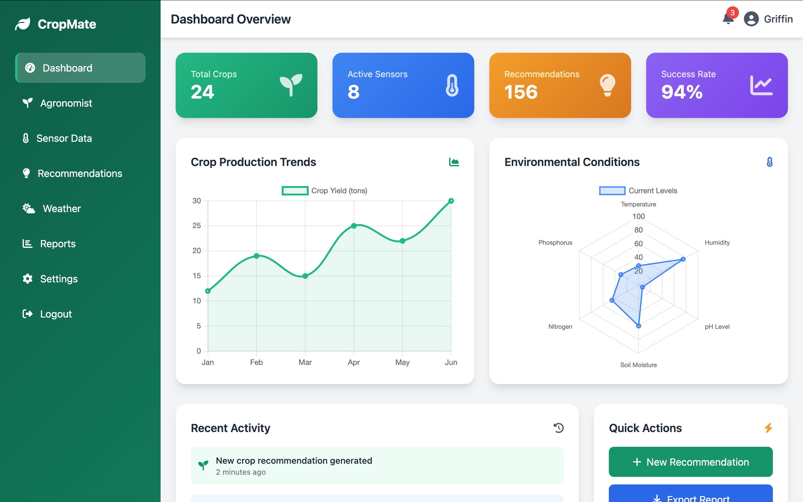
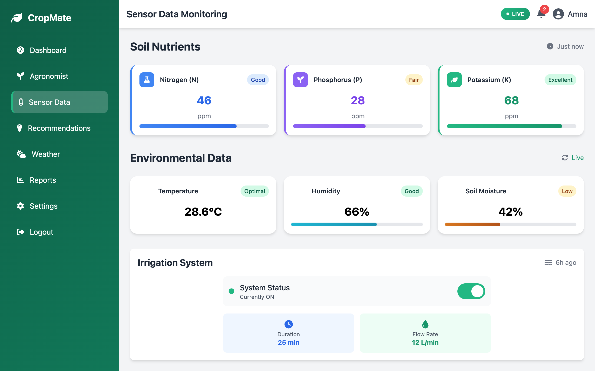
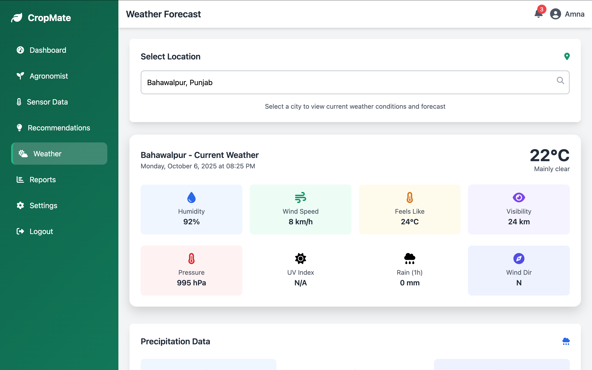

# CropMate 🌱

<div align="center">


*An intelligent agricultural management system that empowers farmers with AI-powered insights, real-time monitoring, and data-driven recommendations.*

[](https://djangoproject.com/)
[](https://python.org/)
[](LICENSE)
[]()

[Demo](#demo) • [Features](#features) • [Installation](#installation) • [Usage](#usage) • [Contributing](#contributing)

</div>

##  Overview

CropMate is a comprehensive agricultural management platform that combines modern web technologies with AI-powered insights to help farmers optimize their crop production. The system provides real-time environmental monitoring, intelligent recommendations, and predictive analytics to enhance farming efficiency and sustainability.

##  Features

###  AI-Powered Virtual Agronomist
- **Smart Recommendations**: Get personalized advice using Groq's Llama-3.1 AI model
- **Expert Knowledge**: Access agricultural best practices and solutions
- **Natural Language Queries**: Ask questions in plain English
- **Instant Responses**: Receive concise, actionable farming advice

###  Comprehensive Dashboard
- **Real-time Analytics**: Monitor crop performance and environmental conditions
- **Interactive Charts**: Visualize production trends and sensor data
- **Key Metrics**: Track success rates, active sensors, and crop statistics
- **Activity Timeline**: Stay updated with recent system activities

###  Environmental Monitoring
- **Sensor Integration**: Monitor NPK levels, soil moisture, and temperature
- **Weather Integration**: Real-time weather data and forecasting
- **Environmental Alerts**: Receive notifications for critical conditions
- **Data Visualization**: Comprehensive environmental data charts

###  User Management
- **Secure Authentication**: Email-based login system
- **User Dashboard**: Personalized farming insights
- **Session Management**: Secure user sessions and data protection

##  Screenshots

<div align="center">

### Login Interface


### Dashboard


### Sensor Data Monitoring


### System Information


</div>

## 🛠️ Tech Stack

### Backend
- **Framework**: Django 4.2.24
- **Database**: SQLite3 (development) 
- **AI Integration**: Groq API with Llama-3.1
- **Authentication**: Django Auth System

### Frontend
- **Styling**: Tailwind CSS 2.2.19
- **Icons**: Font Awesome 6.4.0
- **Charts**: Chart.js
- **UI Components**: Custom responsive design

### APIs & Services
- **Weather Data**: Open-Meteo API
- **AI Assistant**: Groq API (Llama-3.1-8b-instant)
- **Environment Monitoring**: Custom sensor integration

## 🚀 Installation

### Prerequisites
- Python 3.9+
- pip package manager
- Git

### Quick Start

1. **Clone the repository**
   ```bash
   git clone https://github.com/griffin-k/CropMate.git
   cd CropMate/cropmate
   ```

2. **Create virtual environment**
   ```bash
   python -m venv cropmate_env
   source cropmate_env/bin/activate  # On Windows: cropmate_env\Scripts\activate
   ```

3. **Install dependencies**
   ```bash
   pip install -r requirements.txt
   ```

4. **Set up environment variables**
   ```bash
   # Create .env file in project root
   GROQ_API_KEY=your-groq-api-key-here
   SECRET_KEY=your-django-secret-key
   ```

5. **Run database migrations**
   ```bash
   python manage.py makemigrations
   python manage.py migrate
   ```

6. **Create superuser (optional)**
   ```bash
   python manage.py createsuperuser
   ```

7. **Start the development server**
   ```bash
   python manage.py runserver
   ```

8. **Access the application**
   - Navigate to `http://localhost:8000`
   - Register a new account or login with existing credentials

## 📖 Usage

### Getting Started
1. **Register/Login**: Create an account or sign in with existing credentials
2. **Dashboard**: View your personalized farming dashboard with key metrics
3. **Virtual Agronomist**: Ask AI-powered questions about farming practices
4. **Sensor Data**: Monitor real-time environmental conditions
5. **Weather**: Check current and forecasted weather conditions

### Key Workflows

#### AI Consultation
```
Dashboard → Agronomist → Ask Question → Get AI Response
```

#### Sensor Monitoring
```
Dashboard → Sensors → View Real-time Data → Analyze Trends
```

#### Weather Tracking
```
Dashboard → Weather → Current Conditions → Forecasts
```

## 🔧 Configuration

### Groq API Setup
1. Visit [Groq Console](https://console.groq.com/)
2. Create account and generate API key
3. Add to environment variables:
   ```bash
   export GROQ_API_KEY="your-api-key"
   ```

### Environment Variables
```env
# Required
GROQ_API_KEY=your-groq-api-key
SECRET_KEY=your-django-secret-key

# Optional
DEBUG=True
ALLOWED_HOSTS=localhost,127.0.0.1
```

## 📁 Project Structure

```
CropMate/
├── cropmate/                 # Main Django project
│   ├── cropmate/            # Project settings
│   │   ├── settings.py      # Configuration
│   │   ├── urls.py          # URL routing
│   │   └── wsgi.py          # WSGI config
│   ├── dashboard/           # Main application
│   │   ├── models.py        # Data models
│   │   ├── views.py         # View logic
│   │   ├── forms.py         # Form definitions
│   │   ├── urls.py          # App URLs
│   │   └── templates/       # HTML templates
│   ├── manage.py            # Django management
│   ├── requirements.txt     # Dependencies
│   └── db.sqlite3          # Database
├── Images/                  # Screenshots
└── README.md               # This file
```


## 📄 License

This project is licensed under the MIT License - see the [LICENSE](LICENSE) file for details.


## 📞 Contact & Support

- **Repository**: [https://github.com/griffin-k/CropMate](https://github.com/griffin-k/CropMate)
- **Issues**: [GitHub Issues](https://github.com/griffin-k/CropMate/issues)
- **Developer**: [griffin-k](https://github.com/griffin-k)

---

<div align="center">

**Made with ❤️ for sustainable agriculture**

⭐ Star this repo if you find it helpful!

</div>